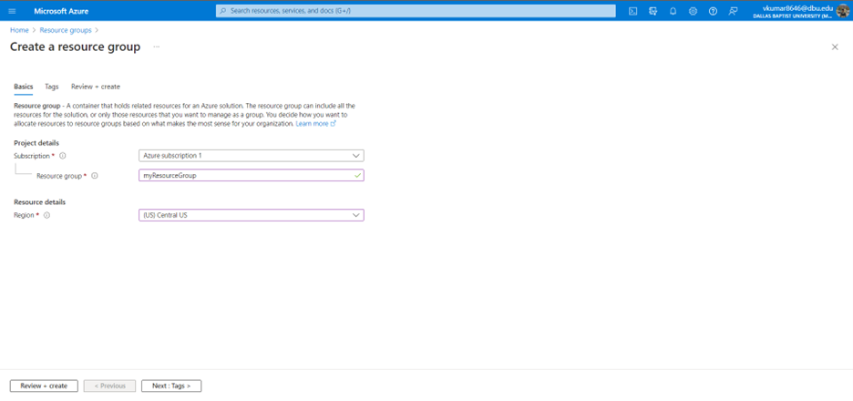
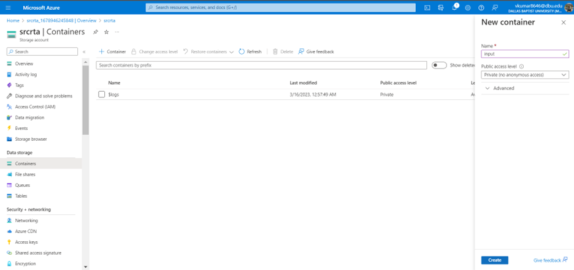
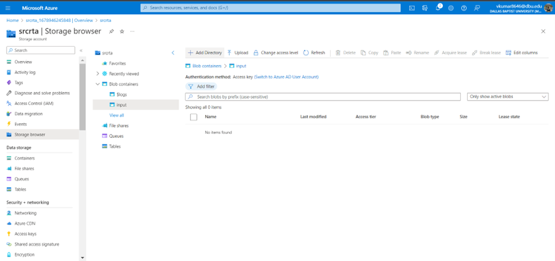
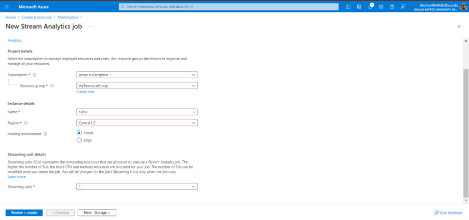
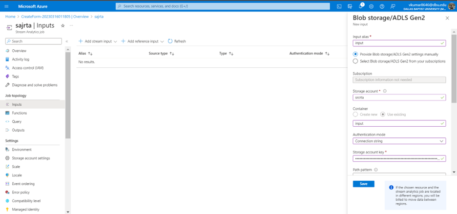
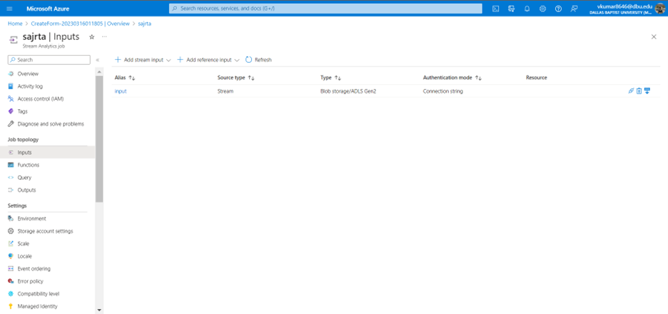
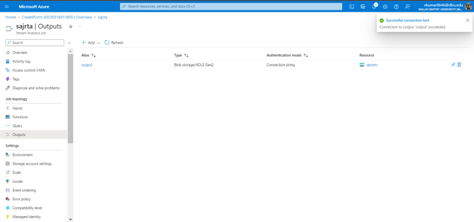
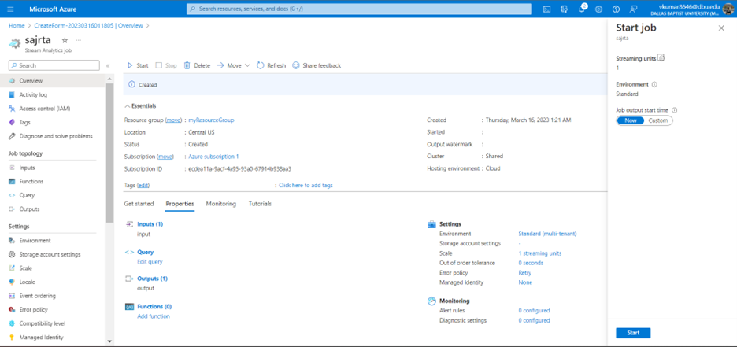
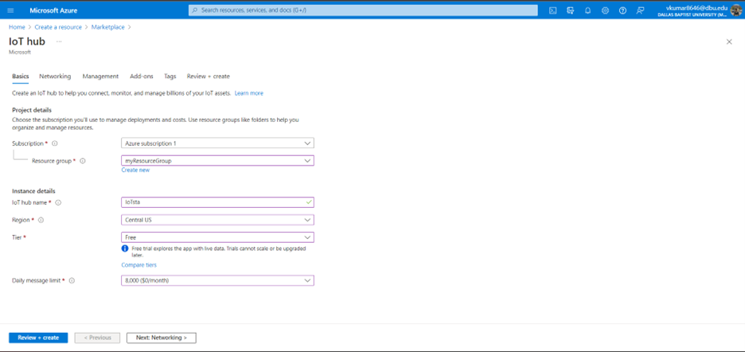
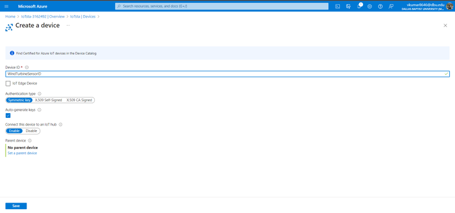

# Real time analytics using Azure

## Pre-requisites
.NET Framework for Windows: https://dotnet.microsoft.com/en-us/download/dotnet-framework

## 1. Data streams and event processing

In the context of this project, data streams are event data generated by sensors or other sources that can be analyzed by another technology. Analyzing a data stream is typically done to measure the state change of a component or to capture information on an area of interest. The process of consuming data streams, analyzing them and deriving actionable insights out of them is called them Event Processing. It requires an event producer event processor and event consumer. 

1. Once you have access to your azure subscription, create a resource group.

2. Create a source storage account and a destination storage account. 

3. Under storage resource, click on containers under the Data storage panel. 
4. Add a new container and give it an alias.

5. After creating container, click on storage browser in the left panel and select blob containers. Navigate to the container that you just created. We will now create a new folder in this container. Click on Add Directory and give it a name. We will name it in the current date format. **YYYY-MM-DD**
6. Repeat steps 2 to 4 to create a destination storage account and give it an alias.
7. Now, we will create a stream analytics job in Azure portal that will transfer data from source storage account to destination storage account. 

8. For hosting environment ensure it is set to Cloud and set streaming units to 1. Click create to create the job. 
9. Before proceeding to the next step, visit your source storage account. Select Access Keys under Security + Networking. Click ‘show’ for the key under ‘key1’ and copy this key. We will require this in the further steps.
10. Once the stream analytics job has been deployed, go to the resource. Select Inputs under Job topology. Since it is a new stream analytics job, you should see no inputs. Let’s add a new stream input. Click on add stream input dropdown and select Blob storage/ADLS Gen2. 

11. Under Blob storage/ADLS Gen2, enter your desired input alias, the source storage account name that you’d created. Change the authentication mode to connection string. For the storage account key, copy and paste the key that you had copied in step 9. Click Save.
12. Your input should look like this.

13. To create an output account, select ‘Outputs’ under Job Topology on the left panel. Follow instructions 9 to 11 to arrive at the desired result.
14. Your output should look like this.

15. Click on query under job topology. Verify your query by making sure that [output] and [input] matches name that you’ve assigned for your output storage and input storage respectively.
16. Go to the Overview tab and start the job.

17. Once the job has been successfully started, go to storage accounts > source storage account > containers > input. Here, you’ll see the folder that you’d created with the YYYY-MM-DD naming format. Select the folder and upload input-01.json. 
18. As the stream analytics job is running, you may go to storage accounts > destination storage account > containers > output. Here you’ll find a new json file that has been generated. On checking the file, we can verify that the contents in both the input and output json files are similar.  

## 2. Creating a IoT Hub and IoT device simulator
1. Create iot hub by looking up iot hub.
2. Go to devices under device management
3. Click on Add device enter WindTurbineSensorID
4. Create device and select it. Copy the Primary connection string and keep it handy. 
5. Now we’ll test an IoT device simulator using VSCode. 
6. Make sure to copy the primary key in line 44 and execute dotnet run in the terminal
7. you must have .NET installed in your system https://dotnet.microsoft.com/en-us/download/dotnet?cid=getdotnetcorecli for this step
8. Once you have .NET installed in the system, execute dotnet run. You should see that the Iot device simulator is running.

## 3. Routing Messages using IoT Hub
1. visit azure portal and navigate to your IoT Hub device. Under Hub Settings select Message routing. 

## 4. Create Azure Stream Analytics Job for Logging route
1. create stream analytics job for logging route

## 5. Sending data into Power BI from Stream analytics job
1. We’ll create event hubs
2. After creating  visit the resource, here you'll create an event hub. Click on add event hub and give it a name, create your event hub.
3. Navigate to your iot hub, go to message routing, create a new routing by clicking on add.
4. Create and enter telemetry text file code.
5. Go to stream analytics job > inputs> add stream input> event hub.
6. After saving, testing. Got to output>add>power bi>authorize

## References
1. Create an IoT hub using the Azure portal.  https://learn.microsoft.com/en-us/azure/iot-hub/iot-hub-create-through-portal
2. Message routing in IoT hub. https://learn.microsoft.com/en-us/azure/iot-hub/how-to-routing-portal?tabs=eventhubs
